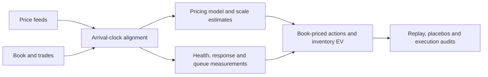

# Crypto Up/Down Prediction-Market Research

**Pricing models, order-book measurements and inventory decisions in crypto up/down markets.**

I studied how a BTC price feed becomes a short-horizon binary-market price, and how that information
can inform a maker's decisions once queue access, latency and inventory enter the problem.
The work combines statistical model construction, event-driven data analysis and policy evaluation
in historical Polymarket five-minute markets during May-July 2026.
The current evidence covers BTC. A positive-EV strategy has not been validated in live trading;
favorable policy results in this repository remain conditional on their replay assumptions.

## What I built and investigated

| Research question | Approach and implementation | Inspect |
|---|---|---|
| What explains the market's price? | Brownian-probit transform; feed, lag and anchor comparisons; constant and feature-dependent pricing scales | [Model](docs/market-pricing-model.md) / [Estimation](docs/pricing-estimation.md) |
| How does information reach the book? | Arrival-clock alignment, venue separation, book-health masks, event response and queue-censoring analysis | [Data engineering](docs/data-engineering.md) / [Measured response](docs/market-response.md) |
| How should paired inventory become an action? | Split/merge accounting, joint fill outcomes, conditional drift, one-step EV and inventory rebalancing | [Equations](docs/mdp-ev-chain.md) / [Policies](docs/strategies.md) |
| Which conclusions survive measurement controls? | Chronological partitions, scrambled signals, paired slot comparisons and execution-harness audits | [Experiment history](docs/negative-results.md) / [Coverage](docs/simulation-coverage.md) |

[Contributions and code](CONTRIBUTIONS.md) provides a short route for research, trading and
engineering reviewers. [Binary risk and Avellaneda-Stoikov](docs/binary-risk-and-market-making.md)
connects the underlying diffusion, terminal inventory risk and the implemented decision problem.

[Working draft](paper/manuscript.md) / [PDF](paper/crypto-working-paper.pdf): what maker value remains
from price information after execution and inventory constraints, with source-linked tables and figures.



## Selected findings

- **Pricing:** a dynamic-scale candidate scored **5.92 ticks mid-price RMSE** on later logs,
  versus **11.06** for the constant model selected by earlier validation. Choosing the dynamic
  candidate after that comparison uses the later result for selection. The public release also
  recomputes seven scale-feature models from **358 archived slot records**.
  [Versions, inputs and evaluation](docs/pricing-estimation.md).
- **Information transmission:** after a qualifying Binance move, the first non-fizzled book move
  agreed with its direction **87.05%** of the time in D4; median delay among correct
  confirmations was **275 ms**.
  These are conditional event measurements, with controls and denominators documented in
  [the response study](docs/market-response.md).
- **Policy structure:** on **368 archived simulated slots**, the EV policy improved on the base
  policy by **68.50 cents/slot**, paired 90% interval **[39.35, 95.17]**. Its advantage over
  scrambled-regime EVM was **26.51 [12.63, 40.80] cents/slot**. The public audit recomputes these
  differences from recorded simulator outputs; queue access and rebalancing quantity assumptions
  limit their interpretation. [Policy comparison](docs/strategies.md).
- **A rejected candidate:** static front quoting had fresh EV(0) of **-0.9845 cents per eligible
  decision moment**, 90% slot-cluster interval **[-1.626, -0.364]**, across **312 moments / 193 slots**.
  The rejection is independently checkable from the released aggregate.
  [Experiment history](docs/negative-results.md).

These results concern different targets and sample units. Pricing fit, modeled policy gains and
realized trading performance are separate claims. This study concerns historical point settlement;
it does not establish a current trading edge.

## Run the research examples

Python 3.10 or newer. Core examples, audits and tests use the standard library:

```bash
python -B examples/walkthrough.py
python -B examples/pricing_walkthrough.py
python -B examples/risk_walkthrough.py
python -B examples/microstructure_walkthrough.py
python -B examples/policy_walkthrough.py
python -B estimators/mechanics_audit.py
python -B estimators/policy_audit.py
python -B estimators/d12_public_verifier.py --check
python -B -m unittest discover -s tests -v
```

Every example identifies synthetic inputs, archived features or recorded simulator outputs.
[Reproducibility](REPRODUCIBILITY.md) covers exact scope and optional plotting dependencies.
No venue credentials or order client are required.

## Repository guide

| Location | Contents |
|---|---|
| `docs/` | Derivations, model versions, engineering decisions and experiment interpretation |
| `src/btc5m_research/` | Inspectable pricing, binary risk, queue, accounting and policy components |
| `data/` | Selected feature records, mechanics summaries and per-slot simulator outputs |
| `examples/`, `estimators/` | Runnable demonstrations and numerical rechecks |
| `evidence/` | Claims, source fingerprints, frozen-input hashes and experiment records |
| `tests/` | Accounting, causality, probability, estimation and decision invariants |
| `paper/` | Working draft v0.3 for feedback, source-linked figures, PDF and document build scripts |

[Evidence coverage](docs/evidence-and-limitations.md) / [Reproduction instructions](REPRODUCIBILITY.md) /
[Historical market and settlement](docs/market-and-settlement.md) / [Security](SECURITY.md)

## Author

[Eren Ege Çelik](https://www.erenege.dev), independent quantitative researcher.
Related work: [weather prediction markets](https://github.com/ErenEgeCelik/weather-daily-max-markets).
Methodological feedback is welcome through repository issues. [MIT license](LICENSE).
