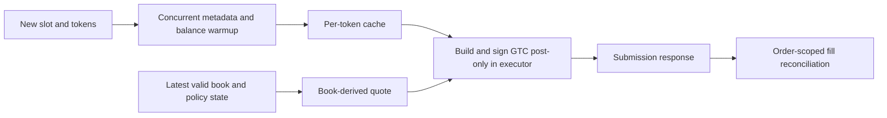

# Data engineering: clocks, health and a common payoff space

The research pipeline joins exchange prices, visible binary-market depth and trades. Alignment and
sample health matter as much as the pricing formula: a silent book socket can manufacture the stable
window a quoting rule is looking for.

## Measurement contract

These definitions were fixed before the publication rechecks. The public packet freezes the first
eight chronologically indexed slots of tape B05, anchor-presence flags, tape bounds and every stored
UP-book gap overlapping those slots. Selection does not depend on health class. The replay recomputes
**slot coverage and class only**; it does not rebuild gaps or anchors from raw WebSocket messages.
Other packets are complete archived aggregate outputs of D4, D4b, D7 and D14.

Run `python estimators/mechanics_audit.py --json`. Input and historical source hashes are in
[the mechanics manifest](../evidence/mechanics_experiments.json).

## Arrival time is the information boundary

Exchange event time and oracle payload time describe the originating event, but cannot establish
when it became available. All decision-time joins use recorder arrival time:

$$j(t)=\max\{j:t_j^{\mathrm{arrival}}\le t\}.$$

Return missing when no preceding observation exists or its age exceeds a declared limit. The portable
`ArrivalSeries` implements this with binary search. A nearest-neighbor match that selects a future
point is inappropriate for a decision-time feature.

Spike signals use **Binance alone**. Concatenating Coinbase and Binance ticks creates jumps from
the cross-venue basis even if each venue is stationary; the historical placebo exposed that artifact.
This differs from fitting a synchronized composite pricing feed. A composite model does not justify
interleaving two event streams into a spike signal.

## Health is independent of quote validity

Compute gaps from **all received book messages**, including empty or invalid books. Apply
`0 < bid < ask < 1` separately for market statistics. Removing invalid quotes first manufactures
communication outages; conversely, a valid-looking quote can be stale.

Historical gap storage floors were 0.5 s for either book, 2 s for Binance, and 5 s for Coinbase and
the oracle relay. Storage floors retain intervals; they are not universal outage thresholds.

A slot begins at `s=300*floor(t/300)`. On health window `W=[s+10,s+290]`, define

$$\operatorname{cov}_g=1-\frac{|W\cap\bigcup_{b-a>g}(a,b)|+|W\setminus\text{tape span}|}{280}.$$

Clip gap overlaps to observed tape span so missing time is counted once. Exclude a slot with less than
half its health window recorded. With start/end anchor indicators `a0,a1`:

| Class | Condition, evaluated in this order |
|---|---|
| FULL | coverage at 1.5 s >=95%, both anchors exist |
| OK8 | coverage at 8 s >=95%, both anchors exist |
| NOANC | coverage at 8 s >=95%, an anchor is missing |
| BAD | Remaining evaluated slots |

`slot_health` preserves this classification. The earlier public gap detector's `>= threshold`
behavior remains available; the historical slot computation explicitly uses **strict `> g`**.
FULL is an offline sample qualification, not a claim every subwindow is clean. Local 1.5-second
breaks still interrupt response/fill measurements. Missing is unknown, not calm; arrival health also
cannot detect the later-discovered case of frequent ticks with a frozen price value.

The archived B05 record reports a 41 ms median book interval and 9.37% of **elapsed book-stream time**
inside gaps longer than 2 s. That percentage is not the proportion of gaps. Its maximum is 33.5 s;
older notes rounded a different snapshot to roughly 32 s. These are historical observations.

## UP-space normalization and reuse

Complementary DOWN price `d` maps to UP price `1-d` and reverses the economic side:

| Token and taker action | UP-space maker side | UP-space price |
|---|---|---|
| UP BUY | ask | p |
| UP SELL | bid | p |
| DOWN SELL | ask | 1-p |
| DOWN BUY | bid | 1-p |

`normalize_trade` preserves this mapping. The historical loader stores five levels per side in typed
arrays, normalizes once, and caches parsed arrays for repeated estimators. Cache identity includes
schema/top-depth requirements. The public package extracts pure operations, without the full recorder
or cache. A mirror-identity check diagnoses data alignment; it does not establish independent liquidity
or permission to double-count mirrored trades.

The selected health packet is a compact recorded-input recheck. The walkthrough demonstrates time
alignment and normalization using synthetic inputs. Sources: `tape_lib.load`, `at_idx`, `gaps`,
`d0_health.slot_health`, `gap_stats`, and `mirror_identity`.

## Execution engineering: cache placement and the actual maker path

The low-latency work extended beyond statistical replay. A shared client family evolved from the
v1 SDK wrapper into a v2 wrapper with explicit metadata caches, concurrent preparation and typed
response handling. The distinction between a capability in the client and a path actually used by
the crypto maker is essential.

| Component | Implemented behavior | Source symbols |
|---|---|---|
| Legacy v1 metadata | Warm SDK tick-size, negative-risk and fee-rate caches before an event | `ClobOrderClient.warm_cache` in the archived `legacy_v1.py` |
| Legacy v1 prepared submission | Build/sign a capped FAK order before the event, then submit it separately in an executor thread | `pre_sign_market_buy`, `post_pre_signed` |
| v2 preparation | Explicit per-token tick/negative-risk/fee caches, version warmup and collateral-balance prefetch; five independent jobs dispatched with `asyncio.gather` and `run_in_executor` | `ClobClient.warm_cache_async` |
| v2 reuse/refresh | Repeated preparation reuses metadata/version and refreshes balance; `force=True` invalidates fee and balance; tick and negative-risk are retained by this historical implementation | `warm_cache_async`, `_options_for` |
| Crypto slot transition | Warm both new outcome tokens, once per token, outside the quote-submission callback | `MakerExecutor._wire` slot-change callback and `_tokens_warmed` |
| Crypto post-only submit | Use cached tick/negative-risk options while building and submitting a GTC order with `post_only=True` in an executor thread | `MakerExecutor._submit`, `ClobClient.post_only_buy_limit`, `_do_post_only_buy_limit` |
| Crypto timeout handling | Bound awaiting concurrent warmup to 8 seconds; the event loop can continue after timeout even though a blocked worker thread can remain | Crypto copy of `warm_cache_async` |

The underlying structure is:

The crypto `_submit` method expresses the bid as an UP-token BUY and the UP-space ask as a DOWN-token
BUY at `1-ask`. This is the complementary acquisition path in that executor version. The project's
split-inventory economic model should not be mistaken for proof that every historical executor
pre-split inventory and sold both outcomes.

The shared v2 client also has `pre_sign_buy`/`fire` helpers that move build/sign work ahead of a FAK
submission. **The inspected crypto maker does not call those helpers**: its post-only quote is built
and signed when submitted. Likewise, `start_keepalive` exists in the client, but no call from the
inspected `mm_maker` establishes that its periodic warm connection task was running. The public
[weather execution example](https://github.com/ErenEgeCelik/weather-daily-max-markets/blob/main/examples/execution_walkthrough.py)
demonstrates the preparation/submission separation with injected fake transports and operation counts.
It is shared engineering provenance, not a measured speedup of this crypto maker.

Cold/warm and parallelization millisecond claims in source comments are not controlled measurements
of this maker route. This release establishes **where network lookups and signing occur**, preserves
the historical latency ledger for simulations, and does not infer an end-to-end speedup from fewer
operations alone. Acknowledgment time, cancellation effect and confirmed-fill time remain separate.
Warmup can fail partially, and the historical client may fall back to synchronous SDK lookups; a warm
flag by itself is not proof of a complete cache or a guaranteed network-free preparation path.
