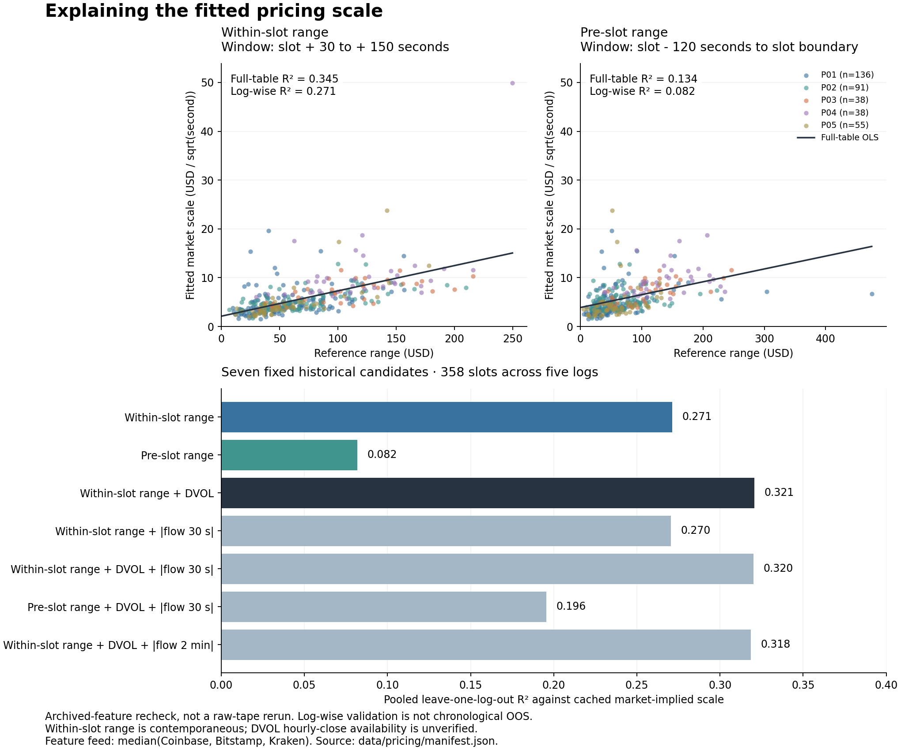

# Reconstructing the market's pricing structure

The pricing work built an interpretable account of how BTC reference prices map into five-minute
binary market mids: align the feeds, test the anchor, linearize the probability link, estimate its
scale, and check whether the result transfers between sessions. The useful result is a measured
pricing structure and a reproducible estimation process. Level-2 observations do not identify an
individual market maker or reveal its private model.

Start with the [estimation and validation procedure](pricing-estimation.md). Run
`python examples/pricing_walkthrough.py` to recover the seven historical feature-model fits from
358 frozen slot rows and to see the transform/anchor calculation on synthetic inputs.

All 358 archived feature rows are shown. The lines use the complete table; the bars refit by
held-out log. [Regenerate the figure](../examples/pricing_figures.py) with the optional matplotlib
dependency. Timing and validation limits are stated on the figure and below.

## The model and the fitted constant

For the historical point-settlement contract, let $F$ be an explanatory spot reference, $F_0$ its
slot-boundary value, $\ell$ the receiver-clock explanatory lag, and $\tau=T-t$ seconds remaining.
The market-mid model is

$$m_t\approx\Phi\!\left(\frac{F(t-\ell)-F_0}{\sigma_m\sqrt{\tau}}\right).$$

Here $\sigma_m$ is a **market-implied pricing scale**, in USD per square-root second. Treating it
as a per-slot constant makes the schedule estimable through a linear regression:

$$x_t=F(t-\ell)-F_0,\qquad z_t=\Phi^{-1}(m_t)\sqrt{\tau},$$
$$z_t=\alpha+\beta x_t+\epsilon_t,\qquad
\hat\beta=\frac{\sum(x_t-\bar x)(z_t-\bar z)}{\sum(x_t-\bar x)^2},
\qquad \hat\sigma_m=\frac{1}{\hat\beta}.$$

The intercept matters: $\hat\alpha/\hat\beta$ is an implied dollar anchor adjustment. Without
it, a feed/oracle basis can be mistaken for volatility mispricing. The model card tested both
oracle anchoring and a feed-self anchor; it did not simply assume that they were interchangeable.

Under an ideal driftless underlying diffusion with constant physical scale $\sigma_S$, the same
probit form gives a terminal-event probability when its anchor and information set match the
settlement event. This theoretical statement does not identify a fitted $\sigma_m$ with
$\sigma_S$. Its assumptions and the induced binary-price diffusion are derived in
[binary risk and market making](binary-risk-and-market-making.md).

## What the original model card measured

The following values come from the recovered **2026-06-12 model-card report**. They are archived
results, not regenerated by the small public fixture. The report and generating code have separate
source hashes in [the manifest](../data/pricing/manifest.json).

| Question | Recorded result | Meaning |
|---|---|---|
| Which synchronized reference best explained transformed mid changes? | Mean(Coinbase, Binance): peak correlation 0.529 at 300 ms; Coinbase 0.472; Binance 0.464 | Candidate explanatory reference and receiver-clock lag; not an exchange execution latency |
| Did a probit schedule fit within a slot? | 340 fitted slots; median transformed $R^2=0.919$, IQR [0.838, 0.963] | Strong within-slot descriptive structure; fitted and evaluated in the same slot |
| Was probit uniquely identified? | Median fitted mid RMSE: probit 2.81 ticks, logistic 2.84 (340 slots each); piecewise linear 4.40 (313) | Probit and logistic were effectively indistinguishable; the piecewise comparison has a different eligible sample |
| Did feed-self anchoring remove the fitted offset? | Median $\alpha\sigma=+\$0.6$, IQR [-$3.8, +$5.9] | Consistent with reduced basis misspecification |
| Was the scale stable across sessions? | May log medians 3.80, 4.72, 3.92; June medians 8.61, 7.04 USD/$\sqrt{s}$ | A single fixed scale did not transfer well across these regimes |

The source also reported a 2.4% median residual improvement from its quadratic extension. That is
a source-specific curvature diagnostic, not a formal test proving Brownian dynamics. The family
comparison supports an economical approximation, not unique identification of the true process.

Exclusive-event comparisons supplemented the correlations. For example, the source reports a
Binance-specific event response minus placebo of +0.48 (95% slot-bootstrap interval [+0.44, +0.51],
491 events) and a Coinbase-only counterpart of +0.42 [+0.39, +0.45] (1,099 events). Those controls
weakened simple relay-only and median-only explanations. They still do not establish causal
membership in an identified maker's private feed.

## What “six ticks” actually means

The model card fitted scale coefficients on May sessions and evaluated them on two later June
sessions. Its inner May validation selected the **constant** scale. That selected model scored
11.06 ticks RMSE; the separately evaluated dynamic candidate scored **5.92 ticks**, MAE 4.84.
Thus the dynamic coefficients were fitted on earlier logs, but adopting the dynamic model after
this comparison uses the held-out result for selection.

| Later-session comparison | Market-mid RMSE, ticks | Evaluation role |
|---|---:|---|
| Constant scale 4.21 | 11.06 | Selected by the inner validation |
| $3.41+0.40\,RV_{15m}$ | 5.92 | Earlier-fitted candidate, favored after the later-session comparison |
| Same-slot fitted scale | 3.87 | Look-ahead fit diagnostic, not a deployable estimator |
| Previous one-second mid | 3.05 | Uses past market prices, a different information set from a feed-only model |
| Constant mid 0.5 | 27.08 | Simple level baseline |

A tick is $0.01 per share. The RMSE above pools eligible quote observations. The source's separate
`slotCI95` bootstraps the **median of per-slot RMSEs**; it is not a confidence interval around that
pooled RMSE. The public feature audit does not recompute either statistic. The study missed its
sub-tick replication target, while demonstrating substantial structure and a clear scale-regime
failure of the fixed-parameter model.

## How the dynamic scale was constructed

The next step made fitted scale the regression target:

$$\hat\sigma_{m,s}=a+bR_{2m,s}+u_s,\qquad
R_{2m}=\max F^{feature}-\min F^{feature}.$$

Candidate features included increment standard deviation at several windows, EWMA volatility,
mean absolute increments, range, large-move size and frequency, and tick activity. The June
refinement selected a compact range relation, approximately

$$\tilde\sigma_m=2.10+0.052R_{2m}.$$

The feature extractor's $F^{feature}$ is a one-second median(Coinbase, Bitstamp, Kraken), whereas
the fitted displacement is mean(Coinbase, Binance). Its range window ends **mid-slot**. These
details were blurred in the old prose; the public code and dataset distinguish them explicitly.
The scale rule is not a newly estimated constant of nature and does not inherit the earlier
dynamic model's 5.92-tick score.

The recovered feature table allows the following comparisons to be recalculated:

| Fixed candidate | In-sample $R^2$ | Leave-one-log-out $R^2$ |
|---|---:|---:|
| Within-slot range | 0.345 | 0.271 |
| Pre-slot range | 0.134 | 0.082 |
| Within-slot range + DVOL scale | 0.383 | 0.321 |
| Within-slot range + absolute 30 s flow imbalance | 0.350 | 0.270 |
| Range + DVOL + absolute 30 s flow imbalance | 0.387 | 0.320 |
| Pre-slot range + DVOL + absolute 30 s flow imbalance | 0.235 | 0.196 |
| Range + DVOL + absolute 2 min flow imbalance | 0.384 | 0.318 |

The historical selection rule chooses range plus DVOL. Flow did not improve the log-wise score
once these features were included. The simpler range model explains much more of the scale's
contemporaneous variation than its pre-slot counterpart. These are useful feature-selection
findings with specific limits: validation is log-wise rather than chronological, within-slot
range is partly contemporaneous, and the collector's DVOL hourly-close availability is unverified.
The winning model was selected on the same folds; 0.321 is not an untouched final-test score.

The released rows recover the range coefficients as $a=2.110723$ and $b=0.051871$, close to the
historical working rule $2.10+0.052R_{2m}$. The cache reproduces this later feature-table fit,
not the exact earlier coefficient selection. The range coefficient's variation across omitted-log
fits is 13.82%. The two-feature fit is
$\tilde\sigma_m=-24.048962+0.043004R_{2m}+5.424802D$, where $D$ is the DVOL scale.
Its range-coefficient CV is 9.76%, while its DVOL-coefficient CV is 31.47%. The historical 20%
selection cutoff applied only to the **first** feature's coefficient, not every coefficient.
Maximum VIF is 1.259. This makes the selection rule and its limits inspectable rather than
hiding them behind the winning score.

## From the fitted schedule to the hybrid fair engine

The feed-self model explained quotes, while execution research needed both an oracle-referenced
level and fast spot-driven changes. Hybrid v1 rebased the estimate at every oracle tick $C_k$:

$$\widehat C^{(1)}_t=C_k+[F(t)-F(t_k)].$$

Every new tick therefore injected the oracle/feed composition difference into short-horizon
changes. Hybrid v2 smoothed that difference instead. With time constant $\theta_o=20$ seconds,

$$d_k=C_k-F(t_k),\qquad a_k=1-e^{-(t_k-t_{k-1})/\theta_o},$$
$$o_k=o_{k-1}+a_k(d_k-o_{k-1}),\qquad
p_t=\Phi\!\left(\frac{F(t)+o_k-K}{\sigma\sqrt{\tau}}\right).$$

The level is referenced to the oracle strike $K$ through a slowly changing basis. Short-horizon
movements mostly follow the fast feed. A separate high-pass state removes persistent fair-minus-mid
bias, with $\theta_h=15$ seconds:

$$g_t=p_t-m_t,\qquad
\bar g_t=\bar g_{t^-}+(1-e^{-\Delta t/\theta_h})(g_t-\bar g_{t^-}),$$
$$h_t=100(g_t-\bar g_t)\quad\text{cents/share}.$$

The source initializes $\bar g$ at the first observed gap, so its first high-pass output is zero.
The gap state resets each slot; the slow oracle/feed offset persists. Positive $h_t$ supplies a
reason to reconsider an exposed ask; it does not supply a new quote price. The derivative channel
uses $100\phi(\Phi^{-1}(m_t))\Delta F/(\sigma\sqrt{\tau})$, an approximate binary-price change
in cents/share from a recently observed feed move, not a guaranteed future price change.

The historical chapter reports the following 478-slot comparison:

| Reference | Level correlation | One-second change correlation | Median absolute fair–mid gap |
|---|---:|---:|---:|
| Feed-self | 0.878 | 0.407 | 6.7 cents/share |
| Oracle only | 0.953 | 0.037 | 5.0 cents/share |
| Hybrid v1, tick rebase | 0.954 | 0.028 | 4.9 cents/share |
| Hybrid v2, smoothed offset | 0.959 | 0.414 | 4.5 cents/share |

This supports the engineering choice to separate a slow level correction from fast changes.
It is a **historical report**, not an independently rerun or chronological OOS result here.
The underlying `hybrid_fair_test.py` uses a fixed per-tick offset weight 0.05 and a 0.5-second
sampling grid; the implemented class uses elapsed-time weights. The chapter's separate 60-slot
class replay reports level correlation 0.928. These are different implementations/evaluations,
not interchangeable rows of one experiment. The diagnostic's raw gap correlation also differs
from the class's high-passed decision state.

The current archived class already contains **hybrid v3** refinements despite its v2 module title:
oracle differences use a lagged feed, $C_k-F(t_k-2s)$, with current-feed fallback when unavailable,
and the scale becomes $1.25+0.50\,RV$. It caches the scale on accepted samples spaced at least
one second apart, retains up to 901 samples, and needs 120 before replacing the initial scale.
That is an intended 15-minute estimate under regular arrivals; sparse samples can span longer
than 15 minutes. This v3 rule is distinct from the June pricing-card and range equations.

The implementation keeps feed buffers, a scalar offset, a scalar gap baseline and a cached scale;
reading fair value does not refit a regression or rescan the volatility history. Public
`time_ema` and `hybrid_probability` expose the core arithmetic with synthetic examples. They
are small explanatory components, not a copy of the complete historical feed/decision service.

## Calibration and realized volatility were separate checks

The work also compared model probabilities with settlement outcomes using Brier scores and the
regression $(Y-p_{model})\sim(p_{market}-p_{model})$. The June 16 report gives Brier 0.1819 for
the range rule, 0.1812 for range plus DVOL, versus about 0.175 for the market. These are historical
point-weighted diagnostics from the feature-study evaluation, with its timing and fitting limits;
they do not establish an OOS improvement in outcome calibration.

The July A2 study then asked a different question: could pre-slot observations predict **realized
underlying** volatility? Its chronological split had 568 fit and 569 evaluation slots. The
historical range rule fell within 20% of realized scale in only 28% of evaluation slots, versus
33% for a refitted range rule. The best reported feature, three-minute mean absolute increments,
had $R^2=0.239$ on the evaluation half, but it was selected using that half. The result is a
validation-selected candidate, not proof that volatility is a known or stable constant.

The modeling contribution is the separation of these objectives and their tests: reconstructing
the quote schedule, explaining its scale, predicting physical volatility, and checking outcome
calibration. In the trading architecture, quote levels still come from the book; the fair model
supplies state, direction and timing. Better mid replication alone does not demonstrate a
profitable quoting policy.

## Public implementation

- [`quote_model.py`](../src/btc5m_research/quote_model.py): transform/inversion, causal lookup,
  a synchronized reference helper that rejects stale required members, and range-rule arithmetic.
- [`pricing_estimation.py`](../src/btc5m_research/pricing_estimation.py): fitted intercept/scale,
  standardized small-model OLS, held-out-log fits, coefficient variability and VIF.
- [`pricing_walkthrough.py`](../examples/pricing_walkthrough.py): synthetic construction plus
  the recorded 358-row feature audit, including fixture-hash verification.
- [`pricing_experiments.json`](../evidence/pricing_experiments.json): exact recovered audit,
  named historical results and their evaluation status.

The synchronized-reference membership guard and standardized OLS are publication implementation
improvements. The historical data values, candidate list, fold partition and selection thresholds
are preserved. No live quote generation, account access or market orders are included.
