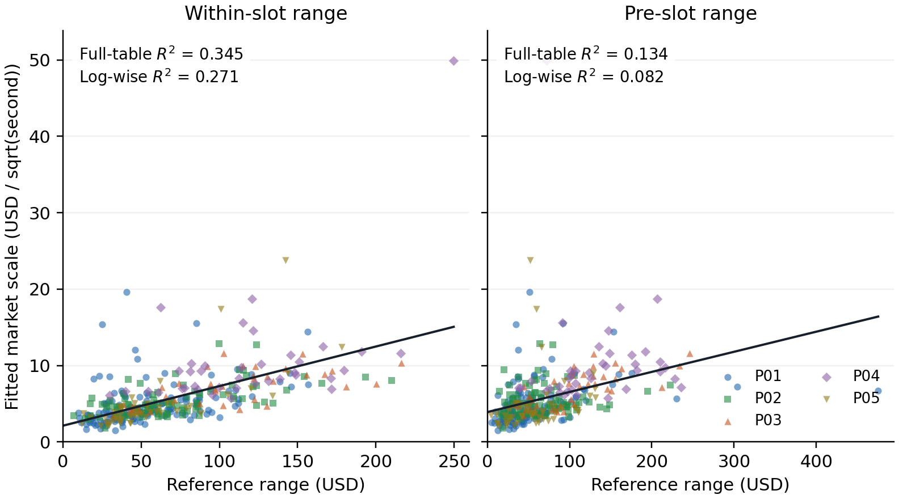
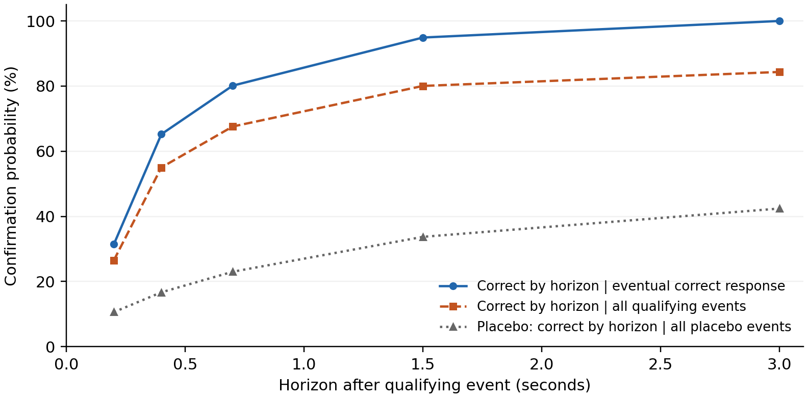
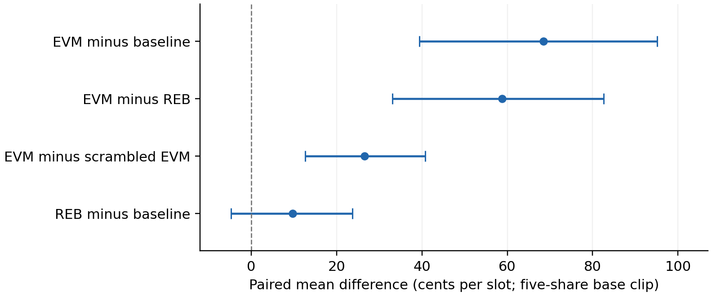

# Pricing and Market Making in BTC Five-Minute Prediction Markets

**Eren Ege Çelik**\
Independent quantitative researcher\
Working paper, version 0.2 - 14 September 2026

## Abstract

This paper studies the connection between price formation and executable decisions in historical
BTC five-minute binary markets. The research combines Brownian-probit pricing, asynchronous feed
and order-book measurements, and inventory-aware policy evaluation. A transformed price regression
describes much of the within-slot variation, while a separate 358-record feature study shows how
strongly the apparent predictability of the fitted scale depends on feature timing. In a historical
event study, 87.05% of non-fizzled first book responses agree with Binance moves of at least \$5
over 200 ms; the
median delay among correct confirmations is 275 milliseconds. These mechanical relationships do
not determine the value of an order without a fill and inventory model. A four-outcome EV
decomposition connects joint fills, conditional drift, rebates and unmatched exposure. Rechecking
368 recorded simulator-output slots gives an EV-policy improvement over the baseline of 68.50
cents per slot, with a paired 90% interval of [39.35, 95.17], subject to unresolved queue, quantity
and decision-availability assumptions. A distinct static front-quoting candidate is rejected on
fresh data at -0.9845 cents per eligible decision moment. The contribution is the empirical and
engineering connection between these layers, with explicit model revisions and reproducible
components. The results do not establish live profitability or transfer to an averaged settlement payoff.

**Keywords:** binary contracts; market microstructure; market making; volatility estimation;
inventory risk; execution modeling; prediction markets.

## 1. Introduction

A five-minute binary contract compresses a continuous underlying-price process into a one-dollar
terminal event. Its short horizon makes a compact diffusion model useful, but also makes the
difference between a statistical relationship and an executable opportunity consequential. A
price-feed move may explain a subsequent book response while arriving too late to obtain the
assumed fill. A quote may earn a favorable short markout while leaving inventory exposed for
minutes. A model may fit market prices without improving on their outcome probabilities.

The motivating question is therefore how a measured description of prices becomes a decision
about when and where to expose inventory. The research was conducted on historical Polymarket
BTC up/down contracts during May-July 2026. Pricing investigations preceded the later
microstructure and policy programme. Their samples overlap neither perfectly nor uniformly, and
their results have different units. This paper connects them without pooling them into one
performance claim.

Three contributions organize the study. First, the pricing investigation separates feed choice,
anchor displacement, link function and pricing scale. It documents the construction of constant,
feature-dependent and hybrid reference models, including the difference between explaining an
implied scale and predicting future underlying volatility. Second, the event-measurement layer
separates receiver-clock availability, feed basis, recorder health, book validity and hypothetical
queue access. Third, the policy layer translates those measurements into explicit joint-fill
rewards and inventory constraints, then compares historical policies and examines failures of
their execution representation.

The analysis preserves useful positive findings and the revisions that qualified them. The aim is
to explain which component supplies information and which additional assumption is needed to turn
it into modeled income. The Gaussian probability map is standard; the contribution lies in its
empirical construction and its connection to the measured decision problem. The public release
contains reference code, selected recorded features, archived mechanics summaries and per-slot
simulator outputs. It provides several levels of reproducibility rather than claiming a complete
reconstruction of unpublished raw tapes.

### 1.1 Related work and the scope of comparison

Interpreting a prediction-market price as a probability requires assumptions about beliefs,
preferences and trading constraints. Manski [L1] and Wolfers and Zitzewitz [L2] provide different
formal perspectives on that interpretation. Here, the observed midpoint is a measured price; a
diffusion-model probability and a fitted market-price description are separately defined objects.

Semenas [L3] studies closely related short-dated BTC binaries using a lognormal digital-option
pricing reduction and a buffered fair-value entry rule. His 182-contract, two-day sample has
positive realized point estimates, but reported intervals include zero, the model does not improve
on market probability scores, and an edge-threshold selection fails out of sample. His volatility
estimator and ranking score are outside the disclosed specification. Our study develops the
pricing-scale estimation and maker-specific measurement layers, then evaluates joint-fill and
inventory decisions. The samples and execution evidence differ, so their numerical returns are
not used as a performance benchmark for this paper.

Avellaneda and Stoikov [L4] connect inventory preferences to market-making quotes through an
execution model. Their distinction between reservation value and trading opportunity motivates
the payoff-specific calculation in Section 6. Glosten and Milgrom [L5] explain how informed
trading can generate a spread and conditional selection effects. These frameworks motivate the
questions; they do not validate our fill proxies, identify a participant's strategy or supply
an economic conclusion for the historical implementations.

## 2. Contract, data and evaluation units

### 2.1 Historical instrument and notation

The studied contract has a 300-second window with start time $t_0$ and expiry $T=t_0+300$.
Let $C$ denote the contractual reference and $K=C_{t_0}$ its starting observation. The historical
research models the UP payoff as $X=\mathbf{1}_{C_T>K}$ and the DOWN payoff as $1-X$.
A complementary pair pays one dollar. The precise tie convention belongs to the individual
contract rules; a continuous diffusion assigns zero mass to an exact tie. A complete archived
rule snapshot is not included in the public data release.

Write $F_t$ for an explanatory exchange feed, $m_t$ for the observed UP midpoint in dollars,
and $\tau=T-t$ for remaining seconds. A feed-self anchor $F_{t_0}$ can describe market-price
formation without being the contractual strike. A persistent difference between $F$ and $C$
is not, by itself, a tradable pricing error. Except where cents are specified explicitly,
prices and terminal payoffs below are in dollars per share. One tick in the study is one cent.

The work concerns point settlement. The author subsequently reported a move toward averaging
in the settlement rule. This paper makes no claim about its exact transition date or weighting
formula and does not apply the point-payoff equations to an averaged payoff.

### 2.2 Research inputs and their boundaries

**Table 1. Main evidence packets. Counts refer to different sampling units and are not additive.**

| Packet | Period / sample | Public evidence and evaluation |
|---|---|---|
| Pricing model card | May-June; 340 fitted slots | Archived model comparisons; earlier-fit/later-log candidate evaluation |
| Scale-feature cache | May-June; 358 slots, five logs | Complete selected cache; seven fixed models refitted with leave-one-log-out scoring |
| Hybrid reference comparison | 478 reported slots; separate 60-slot class replay | Historical descriptive reports from different implementations |
| D4 response study | June-July; 13,782 events at the \$5 threshold | Archived conditional summaries and placebo outputs |
| D7 fill study | 867 FULL slots; 59,376 side-specific virtual touch joins | Archived queue/depletion and censoring measurements |
| D12 grown fresh block | 312 eligible moments in 193 slots | Aggregate decision evidence; original slot-cluster uncertainty reported |
| W policy audit | 18-21 July; 368 common slots in eight tapes | All matched simulator-output rows; paired comparisons and bootstrap recomputed |

The later recorder stores exchange ticks, UP/DOWN book updates and trades with arrival timestamps.
The main event studies use the recorder's receive clock; source timestamps are retained as
additional metadata. Receiver-clock lags include unequal delivery delays and are not direct
measurements of another trader's internal computation time.

The public extraction retains the entire 358-row feature cache and every common W slot in the
specified output snapshot. It does not select favorable observations after observing their scores
or P&L. Source hashes and extraction rules identify the inspected files. They cannot authenticate
collection or prove that a later inspected source revision generated an earlier output.

### 2.3 Evaluation targets

Four targets recur: transformed-price fit, probability forecast score, conditional event response,
and policy income. A transformed $R^2$ is not a directional success rate. A mid-price RMSE is not
a trading return. A cents-per-decision estimate becomes cents per slot only after the number,
quantity and interaction of decisions are specified. The W simulator uses a five-share base clip;
its cents-per-slot results should not be compared directly with D12's cents-per-eligible-moment
estimate.

The research sequence used fresh chronological blocks, permutations and interval estimates, but
was adaptive across experiments. It was not a single globally preregistered strategy search.
Each reported comparison retains its own selection procedure and interpretation.

## 3. Constructing the pricing model

### 3.1 A diffusion probability and a fitted price description

Under an ideal driftless arithmetic Brownian model,

$$
dF_t=\sigma_F\,dW_t,\qquad
p_t=\Pr(F_T>K\mid\mathcal F_t)=\Phi\left(\frac{F_t-K}{\sigma_F\sqrt{\tau}}\right).\tag{1}
$$

$\sigma_F$ has units dollars per square root second. Equation (1) is a conditional probability
under the specified law. Calling it an arbitrage-free venue price would additionally require a
pricing measure and an appropriate replication/friction argument. The empirical model instead
fits the observed market midpoint with an effective scale $\sigma_M$, lag $\ell$, and displacement
$\delta$:

$$
\widetilde m_t=\Phi\left(\frac{F_{t-\ell}-F_0+\delta}{\sigma_M\sqrt{\tau}}\right).\tag{2}
$$

The market-implied scale $\sigma_M$ need not equal physical future volatility. It may absorb
specification error, reference composition and features of the observed price process.

For interior mids, the transformation

$$
y_t=\Phi^{-1}(m_t)\sqrt{\tau},\quad x_t=F_{t-\ell}-F_0,\quad
y_t=\alpha+\beta x_t+\varepsilon_t\tag{3}
$$

gives $\widehat\sigma_M=1/\widehat\beta$ and
$\widehat\delta=\widehat\alpha/\widehat\beta$ for a positive slope. The effective anchor
is $F_0-\widehat\delta$. This intercept interpretation matters: changing the anchor can remove
a systematic basis that would otherwise look like persistent model-market disagreement.

### 3.2 Feed, lag and anchor diagnostics

The model-card pipeline samples books on a 50 ms grid, retains quote age, excludes mids at least
eight seconds old and studies seconds 30-270 of each slot. Exact boundary reference anchors are
required by this pipeline even for feed-self fits. Per-slot regressions use approximately
one-second spacing, mids between 0.05 and 0.95, at least 40 points and displacement sum of
squares $\sum_t(x_t-\bar x)^2\ge4$ dollars squared.

Candidate feeds include individual exchanges and synchronized composites. Lag comparisons use
earlier feed changes and changes in transformed mids, with within-slot correlations aggregated
in Fisher-z space. Exclusive-event checks ask whether the book responds when one candidate
changes and an alternative does not. The archived card's strongest reported synchronized
Coinbase/Binance association has a receiver-clock peak near 300 ms. This supports an explanatory
feed candidate; a midpoint does not reveal an individual maker's private feed or algorithm.

An oracle-anchor fit produced a reported displacement near -\$54, whereas feed-self anchoring
brought the median near +\$0.6. The change diagnoses a basis/specification problem. It does not
measure a \$54 arbitrage. Synchronized composites are also distinct from the alternating
last-tick concatenation that later generated false spike signals (Section 5).

### 3.3 Price-fit results and the constant-scale comparison

**Table 2. Archived pricing-card results. The first rows are within-slot fitted summaries; the
later-log rows use a separate pooled error statistic.**

| Measurement | Value | Interpretation |
|---|---:|---|
| Median transformed probit $R^2$ | 0.919 | IQR [0.838, 0.963], 340 fitted slots |
| Median fitted probit mid RMSE | 2.81 ticks | Same-slot fitted scale and intercept |
| Median fitted logistic mid RMSE | 2.84 ticks | 340 fitted slots |
| Median fitted clipped-linear mid RMSE | 4.40 ticks | 313 qualifying slots; different eligible count |
| Later-log RMSE: selected constant scale | 11.06 ticks | Inner validation selected $\sigma_M=4.21$ |
| Later-log RMSE: dynamic candidate | 5.92 ticks | Earlier-fitted coefficients; candidate favored after this comparison |
| Later-log RMSE: one-second mid persistence | 3.05 ticks | Uses lagged market mid; different information set |

Later-log forecasts use the feed-self anchor with $\delta=0$; within-slot family comparisons
estimate both slope and intercept. The dynamic candidate is $\sigma_M=3.41+0.40\,RV_{15m}$,
where $RV_{15m}$ is the population standard deviation of one-second increments of the cached
median(Coinbase, Bitstamp, Kraken) over $[t_0-15\text{ minutes},t_0)$, with coefficients fit on May 26-28 logs
and evaluated on June 5-6 and June 9. Inner validation actually preferred the constant rule:
median absolute implied-scale error was 1.13 versus 1.30 for the dynamic candidate. Selecting
the dynamic rule after seeing its 5.92-tick later-log error uses that comparison for selection.
It is therefore inappropriate to label the final choice an untouched six-tick OOS result.

The persistence benchmark also places the pricing result in context. A structural model can
describe the underlying-to-binary mapping while predicting a nearby market midpoint less accurately
than the market's own recent value. These errors concern price reconstruction with specified
information sets, not a common executable trading opportunity.

## 4. Estimating scale and maintaining a hybrid reference

### 4.1 Feature formation and availability

The scale-feature cache contains 358 fitted slot records across five source logs. Its target is
estimated at actual book-event times with zero lag, rather than the model card's lagged grid.
The displacement uses the synchronized Coinbase/Binance mean. In contrast, its one-second
feature series is the median of Coinbase, Bitstamp and Kraken. These series have distinct roles.
The feature extractor applies its own point-count, displacement and positive-scale filters;
it does not implement the model card's book-age exclusion.

The within-slot range $R_{\mathrm{in}}$ is the maximum minus minimum over
$[t_0+30,t_0+150]$. The pre-slot range $R_{\mathrm{pre}}$ uses $[t_0-120,t_0]$.
The first is partly contemporaneous with the scale target and unavailable at entry. The second
is measured up to the slot boundary. The cache's annualized DVOL feature is converted to
dollars per square root second, but its collector associates an hourly close with the bar's
timestamp. That close's point-in-time availability is not established. Flow features are
normalized signed Binance volume imbalances over trailing windows; capped pagination leaves
their original completeness unverified.

### 4.2 Fixed candidate comparison

For each of seven historical linear feature specifications, ordinary least squares includes an
intercept. Leave-one-log-out (LOGO) validation estimates coefficients on four logs and evaluates
the fifth, pooling squared errors across omitted logs:

$$
R^2_{\mathrm{LOGO}}=1-
\frac{\sum_i(\widehat\sigma_i-\widetilde\sigma_i)^2}
{\sum_i(\widehat\sigma_i-\overline{\widehat\sigma})^2}.\tag{4}
$$

Here $\widehat\sigma_i$ is the cached fitted target and $\widetilde\sigma_i$ its held-out-log
prediction. Training may include later logs when testing an earlier one. The folds therefore
measure cross-log transfer, not chronological OOS. The historical selection rule requires
LOGO $R^2>0.300$, first-feature coefficient variation below 20% and maximum VIF below five,
then ranks eligible models on the same LOGO scores. The winning score is a validation result.

**Table 3. Recomputed archived-feature scores, all 358 rows and seven fixed candidates. Flow
variables are absolute normalized imbalances; no new model search is performed.**

| Features | In-sample $R^2$ | LOGO $R^2$ |
|---|---:|---:|
| Within-slot range | 0.345 | 0.271 |
| Pre-slot range | 0.134 | 0.082 |
| Within-slot range + DVOL | 0.383 | 0.321 |
| Within-slot range + flow 30 s | 0.350 | 0.270 |
| Within-slot range + DVOL + flow 30 s | 0.387 | 0.320 |
| Pre-slot range + DVOL + flow 30 s | 0.235 | 0.196 |
| Within-slot range + DVOL + flow 2 min | 0.384 | 0.318 |



*Figure 1. Cached market-implied scale and two range features. Lines are full-table OLS fits;
colors identify the five source logs. All 358 records are shown. The within-slot feature ends
150 seconds after entry. The plot describes an archived feature relationship, not an entry-time
forecast or a raw-tape reconstruction.*

The recovered full-cache range rule is
$\widetilde\sigma_M=2.110723+0.051871R_{\mathrm{in}}$; the range is in dollars and scale
in dollars per square root second. The within-slot range explains more of the fitted scale than
the pre-slot range. DVOL improves
the validation score under its unverified timing convention. These are informative results about
model structure and data availability; neither provides a causal trading validation. The archived
feature-study probability diagnostic is also distinct: point-weighted Brier scores were 0.1819
for the range model and 0.1812 with DVOL, against approximately 0.175 for the market. Repeated
outcomes and full-data fitted features limit the interpretation of those historical scores.

A later study changed the target to subsequent realized feed volatility. It split 1,137 slots
into 568 fit and 569 evaluation observations. The historical range rule was within 20% of
realized scale in 28% of evaluation slots, versus 33% for a refit. Its best reported feature
had evaluation $R^2=0.239$, but was selected on that evaluation half. An improved description
of market-implied scale cannot be assumed to solve physical volatility forecasting.

### 4.3 Slow basis, fast changes and the cached state

Execution research needed a reference anchored to the contractual level while reacting to the
faster exchange feed. Hybrid v1 rebased at each reference observation $C_k$:

$$
\widehat C_t^{(1)}=C_k+F_t-F_{t_k}.\tag{5}
$$

Every new reference tick could consequently inject a composition/basis change into a short-term
signal. Hybrid v2 instead smoothed $d_k=C_k-F_{t_k}$ with a 20-second time constant:

$$
a_k=1-e^{-(t_k-t_{k-1})/20},\quad
o_k=o_{k-1}+a_k(d_k-o_{k-1}),\quad
\widehat p_t=\Phi\left(\frac{F_t+o_k-K}{\sigma_M\sqrt{\tau}}\right).\tag{6}
$$

A separate 15-second gap baseline gives a high-pass state:

$$
g_t=\widehat p_t-m_t,\quad
\bar g_t=\bar g_{t^-}+(1-e^{-\Delta t/15})(g_t-\bar g_{t^-}),\quad
h_t=100(g_t-\bar g_t).\tag{7}
$$

The gap starts at its first observation, so its initial high-pass output is zero. It resets each
slot; the slow basis persists. The scalar $h_t$ is measured in cents per share and supplies
timing/direction state, while executable quote levels remain book-derived.

The historical 478-slot diagnostic reports hybrid-v2 level/change correlations of 0.959/0.414,
compared with 0.954/0.028 for tick-rebased v1. That diagnostic used a fixed per-tick offset
weight of 0.05; the implemented class used elapsed-time weights, and its separate 60-slot replay
reported level correlation 0.928. The versions should not be combined into one experiment.

The inspected later class already contains v3 refinements: reference differences use a two-second
lagged feed, with a current-feed fallback, and scale becomes $1.25+0.50\,RV$. Scale updates
are cached on accepted samples at least one second apart, retaining at most 901 samples and
requiring 120 before replacing the initial value. Under sparse arrivals, that buffer spans
more than 15 minutes. Reading fair value uses buffers and scalar state; it does not refit
a regression or rescan the volatility history on every quote decision.

## 5. From feed events to observable book mechanics

### 5.1 Clock discipline and health

An as-of join uses the latest observation received no later than the specified cutoff, with
an explicit maximum age. Availability and validity are separate: an empty book update proves
that the recorder received a message, although it may not provide a valid two-sided quote.
Treating invalid messages as absent can inflate apparent outage duration.

The later clean index classifies a 280-second within-slot window
$\mathcal W=[t_0+10,t_0+290]$. If $G_g$ is the union of book gaps strictly longer than $g$
and $\mathcal I$ the recorded tape span, coverage is

$$
\operatorname{cov}(g)=1-
\frac{|G_g\cap\mathcal W\cap\mathcal I|+|\mathcal W\setminus\mathcal I|}{280}.\tag{8}
$$

Windows with less than half their duration recorded are excluded. FULL requires coverage at
1.5 seconds of at least 95% and both boundary anchors. OK8 applies
the same criterion at eight seconds when FULL fails. Missing anchors and poor coverage have
separate states. A FULL slot can still contain local breaks that terminate a particular
event window. The archived B05 packet has a 41 ms median book interval, 9.37% of elapsed
book-stream time inside gaps longer than two seconds, and a maximum gap of 33.5 seconds.
Older overviews rounded a different snapshot to roughly 32 seconds.

Alternating latest ticks from two venues with a stable basis creates artificial jumps.
The subsequent event-signal programme uses Binance alone. UP and DOWN records are also
normalized to a common economic side before analysis, without counting mirrored book liquidity
twice. Arrival health does not detect a frequently updating but frozen price value; the
later paper-engine investigation identified that additional failure mode.

### 5.2 First response and conditional confirmation

D4 defines a qualifying Binance displacement over 200 ms, thresholds of \$3, \$5 or \$8,
and a one-second deduplication rule. It samples FULL slots at offsets 10-200 seconds,
uses an as-of book no older than 0.5 seconds and scans up to three seconds for the first
nonzero midpoint move. A gap above 1.5 seconds ends the scan. An opposite first move remains
wrong-direction even if a later response agrees. No move before the horizon or break is a
historical fizzle.

At the \$5 threshold, the archive has 13,782 events and 3.11% fizzles. Among non-fizzles,
87.05% of first moves agree with the feed direction, against 49.48% for the random-time,
random-direction placebo. Median delay among correct confirmations is 275 ms. The reported
65.23% confirmation rate within 400 ms is conditional on eventual correct confirmation.
Consequently the approximate unconditional probability is

$$
\Pr(\text{correct by }h)\approx
(1-f_{\mathrm{fizzle}})(1-f_{\mathrm{wrong}})
\Pr(L\le h\mid\text{correct}),\tag{9}
$$

which gives 55.02% at 400 ms from the rounded \$5 fields. These denominators express different
questions and should not be interchanged.



*Figure 2. Archived D4 \$5 confirmation summaries at the stored horizons. Conditional
confirmation is measured among eventual correct responses; the unconditional approximation
also includes fizzles and wrong-direction first responses. Values are joined for orientation;
the archive does not provide a full continuous-time CDF or pointwise uncertainty. The placebo
uses its own conditioning and is not an executable-return benchmark.*

D4b studies the subsequent size of the book response. It groups events by future realized
one-second feed displacement and finds decreasing book response per dollar: at two seconds
after confirmation, the ratio falls from about 0.716 cents/\$ in the \$3-5 bucket to 0.311
in the \$20-and-above bucket. Because bucketing uses future displacement and requires a
direction-correct response, this is an explanatory saturation measurement. It is not an
entry-time signal or proof that the residual response can be captured.

D14 is a separate calm-to-spike study with a different first-move definition and a 280 ms
median. Its pre-spike calm window excludes the spike's own 200 ms displacement interval.
The distinction matters: a superficially similar response estimate can arise from a different
conditioning set and observation horizon.

### 5.3 Queue walks, censoring and the flow model

Level-2 data does not reveal the queue rank of a counterfactual order. The replay therefore
walks hypothetical orders through displayed depth and later prints. A trades-only convention
credits side-matched trades; a second convention additionally credits unexplained size drops.
These are sensitivity scenarios, not proven bounds on actual fills: cancellations ahead,
replenishment, hidden priority and response to our own order are unknown.

Let $r_0$ be visible depth ahead, $\lambda$ trailing side/price-specific flow in shares per
second, and $H$ a horizon. D7 investigates $x=\lambda H/r_0$ and an exponential fill model
$1-e^{-kx}$. Its archive contains 59,376 virtual joins across 867 FULL slots. In the
trades-only convention, 84.6% are censored, chiefly by a change in the touch. At horizon $H$,
both numerator and denominator include only observations with independently computed capacity
$c_i\ge H$. Short-capacity observations are excluded even if they filled early. This estimates
fill frequency conditional on sufficient observation capacity, not unconditional fill probability
under established non-informative censoring.

The fitted model's discrimination is preserved after permuting trailing flow: 0.4077 with
the real input and 0.4156 after permutation. It also overpredicts some middle buckets.
A stable fitted coefficient does not establish useful flow information. Later controls
perturbing wall size further clarify the source of discrimination. The policy consumes
empirical lookup tables, while the retained composite bucket does not prove that $\lambda$
adds predictive value beyond depth.

Historical D7 queue walks start at the decision instant and do not include POST activation
latency. The subsequent D12 economics study applies the 50 ms correction; D7 curves therefore
are not activated-order fill probabilities.

### 5.4 Activation and the actual execution route

The maker decision baseline is 50 ms for activation and 50 ms for cancellation. Historical
maker POST measurements were 24-50 ms and cancellation medians 23-50 ms; 218 ms is a
cancellation tail under load. The 250-330 ms figures refer to the taker path. These intervals
measure different operations and cannot be substituted for one another.

An order cannot consume trades before its activation time. A cancel request leaves exposure
until modeled removal. Correcting activation in the front experiment removed much of its
apparent opportunity. Acknowledgment, effective cancellation and observed fill reconciliation
remain separate execution events.

The shared client evolved from v1 SDK-cache warming into explicit v2 per-token metadata,
version and collateral-balance preparation, dispatched concurrently outside the quote callback.
The inspected crypto maker warms new outcome tokens at slot transition and uses cached
tick/negative-risk options. Its GTC post-only order is still built and signed during submission
in an executor thread. Shared pre-sign/FAK helpers exist but are not called by that route.
This source trace establishes where preparation occurs; it does not establish an unmeasured
end-to-end speedup.

That executor buys UP for an UP-space bid and buys DOWN at $1-\text{ask}$ for an UP-space ask.
Its complementary acquisition route differs operationally from selling pre-split inventory.
Both can be expressed through signed UP exposure, but balance requirements, collateral
reservation and fill mechanics must be mapped separately. The accounting below is an economic
coordinate system, not evidence that every historical executor used the same order path.

## 6. Binary inventory risk and reservation value

For cash $c$, UP holdings $q_U$, DOWN holdings $q_D$ and imbalance $I=q_U-q_D$,

$$
W_T=c+q_D+IX,\quad
\mathbb E_t[W_T]=c+q_D+Ip_t,\quad
\operatorname{Var}_t(W_T)=I^2p_t(1-p_t).\tag{10}
$$

Matched pairs have a certain payoff. At a fixed probability, the unmatched terminal variance
has no separate maturity multiplier; it is not constant along a path because $p_t$ changes.

Under the matched constant-volatility assumptions of (1), Itô's formula gives

$$
dp_t=\frac{\phi(\Phi^{-1}(p_t))}{\sqrt{\tau}}\,dW_t
\equiv\sigma_P(p_t,\tau)dW_t.\tag{11}
$$

The cancellation of $\sigma_F$ holds after conditioning on the same probability; the
underlying scale still determines the displacement-to-probability map. At $p=0.5$, reducing
remaining time from 100 seconds to one second multiplies instantaneous binary diffusion
by ten. Yet integrated future quadratic variation satisfies

$$
\mathbb E_t\left[\int_t^T\sigma_P(p_s,T-s)^2ds\right]=p_t(1-p_t).\tag{12}
$$

Today's diffusion squared times remaining time need not equal (12). A stochastic fitted
scale in (2) also introduces additional drift/variation terms and does not inherit the
martingale identity automatically. Appendix A supplies the constant-parameter derivatives.

Avellaneda-Stoikov's Brownian frozen-inventory center is
$r=s-q\gamma\sigma_S^2(T-t)$ [L4, equations 6-8]. For a one-dollar Bernoulli payoff, the
corresponding frozen-inventory certainty equivalent can instead be calculated directly.
Let $\gamma>0$ be risk aversion in inverse dollars:

$$
M(I)=1-p+pe^{-\gamma I},\qquad
C(I)=-\gamma^{-1}\log M(I).\tag{13}
$$

The exact one-share indifference bid and ask are

$$
b(I)=C(I+1)-C(I),\qquad a(I)=C(I)-C(I-1).\tag{14}
$$

For small $\gamma$ and fixed inventory,

$$
C(I)=Ip-\tfrac12\gamma I^2p(1-p)+O(\gamma^2),\quad
\frac{a(I)+b(I)}2=p-\gamma Ip(1-p)+O(\gamma^2).\tag{15}
$$

Thus the familiar Bernoulli inventory adjustment is an approximation, rather than an exact
finite-inventory quote rule. At $p=0.5$, $I=0$, $\gamma=0.1$, (14) gives approximately
0.487505 and 0.512495 dollars. Execution quotes additionally require queue access, arrival
behavior, ticks and operational constraints. This exact calculation is explanatory work
added to clarify the historical argument; the implemented policy did not quote around
an A-S reservation center.

## 7. From joint fills to an inventory-constrained policy

### 7.1 Four outcome values

Use UP-book coordinates in cents. Let $q_A$ be an ask, $q_B$ a bid and $m$ the decision
mid, giving $s=q_A-q_B$, $\delta_A=q_A-m$ and $\delta_B=m-q_B$. Selling DOWN at
$v_D=100-q_B$ cents is economically represented by the synthetic bid coordinate. An A fill
reduces signed UP exposure; a B fill increases it.

Write $A=\Pr(F_A)$, $B=\Pr(F_B)$ and $J=\Pr(F_A\cap F_B)$. Feasible branch weights require

$$
\max(0,A+B-1)\le J\le\min(A,B),\quad
(p_{AB},p_A,p_B,p_0)=(J,A-J,B-J,1-A-B+J).\tag{16}
$$

The empirical adjustment uses $AB\rho$ projected onto this interval. The frozen
$\rho=1.036$ is a joint-fill multiplier, not a correlation coefficient. Conditioning
does not impose a universal sign on the covariance of regime-specific fill probabilities.

Let $r_A,r_B$ be historical maker rebates. The observed signed drifts are
$m_{\mathrm{fill}+5s}-m$ for A and $m-m_{\mathrm{fill}+5s}$ for B; $\Delta_A,\Delta_B$
denote the mean drift-cost inputs used in EV. The selector estimates regime-conditioned means
from the corresponding JOIN fills and treats them as representative of unmatched branches.
That transfer is a modeling approximation, not an exact empirically estimated A-only/B-only
conditional mean. Rewards and EV in the following table use cents per paired unit;
probabilities are dimensionless.

**Table 4. One-decision branch accounting. Additional cost $\alpha\ge0$ applies to unmatched fills.**

| Outcome | Probability | Reward |
|---|---|---|
| Both | $J$ | $s+r_A+r_B$ |
| A only | $A-J$ | $\delta_A+r_A-\Delta_A-\alpha$ |
| B only | $B-J$ | $\delta_B+r_B-\Delta_B-\alpha$ |
| Neither | $1-A-B+J$ | $0$ |

The paired value is the weighted sum:

$$
\begin{aligned}
E_2(\alpha)={}&J(s+r_A+r_B)\\
&+(A-J)(\delta_A+r_A-\Delta_A-\alpha)\\
&+(B-J)(\delta_B+r_B-\Delta_B-\alpha).
\end{aligned}\tag{17}
$$

The identity $\delta+r-\Delta$ equals mark-to-mid trading value plus rebate. Adding a
quote-price markout to $\delta$ again would double-count the spread. For single-side
actions, $E_A=A(\delta_A+r_A-\Delta_A)$ and $E_B=B(\delta_B+r_B-\Delta_B)$; their sum
need not equal $E_2(0)$ because completing both legs removes unmatched drift exposure.

For quote/execution price $v$ in dollars, the historical rebate model is
$r(v)=1.4v(1-v)$ cents per share, with zero maker fee; terminal taker flattening uses
$f(v)=7v(1-v)$ cents per share. These are study accounting assumptions,
not a current venue schedule. They are separated from trading income.

### 7.2 State, continuation value and implemented policy

A full event-driven control formulation would contain regime, outstanding quotes, queue
state, signed inventory and slot phase, with a random next-event time $t'$:

$$
V_t(s)=\max_a\mathbb E\left[r(s,a,S_{t'})+V_{t'}(S_{t'})\mid S_t=s,a\right].\tag{18}
$$

The older MDP2 implementation evaluated policy families through a generative chain and
uncertain measurement links. Its Monte Carlo frequency of positive EV was conditional on
the supplied parameter distributions, not a calibrated posterior probability of profitability.
The later EVM policy uses a one-step decision estimate and inventory rules. Neither solves
the full continuation value in (18).

The D8 baseline quotes a five-share clip at stable-book decision windows, joining a narrow
book or improving each side by one tick when the spread is at least three cents. Maker
activation and cancel delays are 50 ms. A qualifying Binance move triggers cancellation
of the threatened side; the book provides a fallback. An inventory clamp prevents
exposure-increasing quotes at $|I|\ge15$, and residual inventory is flattened at 200 seconds.

D11 adds maker rebalancing (REB). At a settle boundary with $|I|\ge5$ and no new baseline
episode, it quotes the reducing side for the imbalance. Controls include immediate taker
unwind, drift-based episode skips and matched-frequency random skips. These distinguish
the value of obtaining a maker exit from the effect of simply reducing participation.

D15 evaluates every settle window using A+B-frozen fill and drift tables. With small
inventory, it selects the feasible positive maximum of $\{0,E_A,E_B,E_2(0)\}$. At larger
imbalance, it forces a reducing quote even when its one-step value is negative; an
exposure-increasing clip remains optional and constrained. REB is therefore a risk rule,
not an optimized continuation term. The paired-unit value is not used as a valuation
of unequal rebalancing quantities.

Regime uses the trailing 1.5-second Binance move: absolute displacement below \$3 is calm,
at least \$8 is directional, and the intermediate region is neutral. Drift calibration
conditions on decision-time regime. Front marginal fill rates, however, transfer from
front-calm calibration, and JOIN drift/joint estimates are reused for front quoting.
Ten-second fill estimates rank variable-duration windows. These transfer assumptions
remain part of the model.

## 8. Policy evidence and revisions

### 8.1 Static front quoting: a favorable-cost rejection

The D12 static front-calm experiment studies clean FULL slots at offsets 10-200 seconds,
sampling paired opportunities every 50 book events. Calm requires absolute as-of Binance
displacement below \$3 over 1.5 seconds. Two-sided one-tick improvement requires a spread
of at least three cents. The hypothetical front opportunity ends when the observed book
occupies the improved level, subject to a ten-second maximum and local validity constraints.
Fills cannot begin before 50 ms activation.

Unmeasured additional cost enters the unmatched channel monotonically:

$$
E(\alpha)=E(0)-w\alpha,\qquad w=A+B-2J\ge0.\tag{19}
$$

For $E(0)>0$ and $w>0$, the zero is $\alpha^*=E(0)/w$. If $E(0)<0$, nonnegative
$\alpha$ cannot rescue the fixed candidate. This argument is conditional on eligibility,
fill and drift estimation; it does not validate those inputs.

**Table 5. Archived D12 decision evidence. Units: cents per eligible decision moment.**

| Sample or sensitivity | EV(0) |
|---|---:|
| Discovery A | +0.3383 |
| Discovery B | +0.4325 |
| Grown fresh F | -0.9845 |
| Fresh 90% slot-cluster interval | [-1.626, -0.364] |
| Chronological final 30% | -0.9989 |
| Final 30%, frozen analytic model | -0.3772 |
| Fresh, most favorable single-slot omission | -0.8792 |

The grown fresh block covers 312 moments in 193 slots. Its interval lies below zero even
at the favorable $\alpha=0$ boundary, and no single omitted slot restores the sign.
The decision rejects this static candidate within the represented model. The chronological
split and fresh block are related checks, not independent replications. The public verifier
reapplies the decision rule to stored aggregate values; it does not reconstruct the original
confidence interval or event selection.

### 8.2 Inventory policies: matched simulator-output comparisons

Earlier D11 and D15 reports motivate the inventory mechanism. In the 1,013-slot A+B+F
report, REB improved on base by 10.9 cents/slot, CI90 [2.5, 19.5]. The later EVM-minus-REB
comparison was 67.8 [53, 82]. A grown fresh F=371 comparison reported EVM-minus-base
83.8 [56.5, 111.7]. These are different historical reports; their original common
per-slot archives are not regenerated in this paper.

The available W snapshot instead contains 368 common slots from eight tapes on July 18-21.
The public audit matches base, REB, EVM and scrambled EVM one-to-one and retains every
matched slot with FULL status. For pair $(a,b)$ it computes $d_i=P_{a,i}-P_{b,i}$ and
the arithmetic mean. A fixed-seed bootstrap resamples whole paired slots 2,000 times,
reporting the linearly interpolated fifth and 95th percentiles. This is a recorded-output
recheck; it does not simulate new fills or correct the historical producer.

**Table 6. Recomputed W paired differences, 368 slots. Units: cents per slot at the
historical five-share base clip, including modeled rebates and flatten costs.**

| Difference | Mean | Paired 90% interval |
|---|---:|---:|
| EVM - base | +68.50 | [39.35, 95.17] |
| EVM - REB | +58.78 | [33.05, 82.62] |
| EVM - scrambled EVM | +26.51 | [12.63, 40.80] |
| REB - base | +9.72 | [-4.72, 23.72] |



*Figure 3. Means and paired 90% slot-bootstrap intervals from all 368 common W outputs.
Scrambled EVM preserves placement and inventory mechanics while swapping regime labels.
Intervals measure variation of recorded simulator outputs and do not include queue-model,
quantity or online decision-availability uncertainty. REB-minus-base includes zero in W,
unlike the earlier pooled D11 report.*

The EVM comparison contains both structural and regime-conditional components. Quoting
every eligible window and managing unmatched inventory differ from the baseline; the
scrambled comparison holds more of that structure fixed. It is one deterministic label
swap, not an exhaustive randomization distribution. Per-tape summaries and a descriptive
chronological 70/30 split are included in the audit, but do not create another untouched
test after reviewing the whole W block. Slot resampling does not model dependence
between neighboring slots.

### 8.3 What the positive replay does not identify

Several implementation details materially bound interpretation. The historical REB walk
uses fill timing independent of the requested imbalance, then credits the full quantity
on a proxy fill. Same-window fills are evaluated from starting inventory without an
intra-window adaptive decision. Front probabilities and drift inputs transfer between
conditions that were calibrated separately.

Decision availability is an additional issue. The replay reconstructs settle groups
using future touch-event gaps shorter than 0.5 seconds and references entry to the
group's last event. An online process cannot know at that event that the group has
ended. The replay does not establish equivalent online availability after the required
confirmation delay. Positive W values therefore remain conditional outputs of the
historical simulation, rather than executable upper bounds with every timing assumption
already established.

The public component enforces the missing lower Fréchet bound, preserves real zero
calibration values and separates unknown state from neutral. Those are explicitly
documented corrections. The archived W results are not attributed to a rerun with
the corrected component.

### 8.4 Paper-engine discrepancies as diagnostic evidence

A same-window comparison found approximately +\$21 in replay against approximately -\$31
in a six-slot paper-engine stress segment. Investigation identified cold-start regime
blindness, stale-value handling, inventory-cap behavior, loss-limit rearming and
configuration mismatches. Because the paper implementation was defective, the discrepancy
does not estimate the economics of a clean live strategy. It identifies conditions that
the replay and implementation failed to share.

An earlier 157-slot A/B comparison is a separate campaign invalidated by incorrect
execution assumptions. An older generative-chain calibration also involved a run with
78.4% balance rejects; reproducing its funnel was a mechanics check. These observations
are retained as research diagnostics, not merged with the W output recheck into a
live performance record.

## 9. Reproducibility and limitations

The technical release at revision `6db010205b3aa3b8b4ee1d5715e06c47de8023b7` includes
126 tests covering accounting, causality, probability constraints, estimation and policy
behavior. A clean GitHub checkout passed those tests, 14 example/audit invocations and
19 published-file hash checks. These are software and release checks; statistical
validity does not follow from a passing test suite.

**Table 7. What a reader can reproduce from the public package.**

| Layer | Public operation | Remaining boundary |
|---|---|---|
| Analytical components | Pricing transform, diffusion, terminal moments, exact CARA values | Assumptions determine applicability |
| Pricing feature study | Refit seven candidates on 358 cached rows | Original observations and point-in-time feature formation not reconstructed |
| Mechanics | Audit conditional summaries and selected health classifications | Event selection, original placebo estimates and most uncertainty remain archived |
| Policy | Evaluate synthetic states with frozen calibration; recheck 368 matched outputs | Historical fill paths, queue access and execution capacity not regenerated |
| D12 verdict | Apply the decision rule and byte-check the committed result | Original aggregate estimator and raw tapes remain upstream |

The most significant limitations concern identification and execution. A price fit
does not identify a participant. A sample selected through a model cannot by itself
validate the model's probability interpretation. A visible trade need not have filled
our counterfactual order. Full-slot health does not ensure every subwindow is usable.
The historical samples cover limited regimes, and repeated researcher choices complicate
the interpretation of the strongest selected comparison.

Publication source hashes pin inspected inputs; they are not cryptographic proof of
historical collection. Some code evolved after a stored output was produced. The
publication records identify this distinction rather than assigning a false exact
producer. Full raw-tape reconstruction, independently audited instrument rules and
quantity-aware, causally scheduled execution comparisons would strengthen the evidence.
No new trading experiment is implied by this document release.

## 10. Discussion and conclusion

The results locate useful structure at several levels. Feed/anchor diagnostics and
probit regression provide an economical description of the binary price surface.
The feature study shows why a scale that explains a contemporaneous market trajectory
may be weak when restricted to information available at entry. Slow basis correction
and fast feed changes can coexist in a cached reference state. Event studies measure
how already-observed information reaches the book, provided timing and conditioning
are stated precisely.

The inventory formulation makes a separate contribution: paired and unmatched outcomes
have different reward and risk channels. A joint-fill decomposition prevents spread
double counting and explains why one-sided drift costs cannot simply be attached to
a completed pair. Rebalancing improves modeled outcomes in some samples, while the
W comparison also demonstrates that this effect depends on sample and convention.
The static front candidate fails a distinct favorable-cost fresh-data test.

The paper's central conclusion is that each transition from price description to
trading value adds an empirical obligation. Feed alignment does not establish queue
access; a branch EV does not establish capacity; a stateful replay does not establish
online decision availability. The released methods, corrections and compact evidence
make these obligations inspectable and provide a foundation for further research.

## Appendix A. Binary diffusion and utility identities

For $z=(F-K)/(\sigma_F\sqrt{\tau})$ and $u(F,t)=\Phi(z)$,

$$
u_F=\frac{\phi(z)}{\sigma_F\sqrt{\tau}},\qquad
u_{FF}=-\frac{z\phi(z)}{\sigma_F^2\tau},\qquad
u_t=\frac{z\phi(z)}{2\tau}.\tag{A1}
$$

The drift $u_t+\tfrac12\sigma_F^2u_{FF}$ is zero. Multiplying $u_F$ by $\sigma_F$
gives (11); Itô isometry for the bounded martingale gives (12). With a known deterministic
volatility schedule, replace $\sigma_F^2\tau$ by
$V_t=\int_t^T\sigma_F(s)^2ds$. The diffusion coefficient becomes
$\phi(\Phi^{-1}(p_t))\sigma_F(t)/\sqrt{V_t}$. A fitted stochastic scale requires
additional terms and a separately specified model.

For exponential utility $-e^{-\gamma W}$, buying one share at $b$ preserves utility
when $e^{\gamma b}M(I+1)=M(I)$, giving (14). Selling one share at $a$ requires
$e^{-\gamma a}M(I-1)=M(I)$. Expanding the logarithm of the Bernoulli moment-generating
function yields (15). The risk-neutral limit is $C(I)=Ip$ and $a=b=p$.
The public implementation retains tilted probabilities in log space so that a large
risk-aversion increment cannot erase a numerically small but recoverable tail.

## Appendix B. Reproduction route and source map

From the repository root, the following use Python 3.10+ and its standard library:

```text
python -B examples/pricing_walkthrough.py
python -B examples/risk_walkthrough.py
python -B examples/microstructure_walkthrough.py
python -B examples/policy_walkthrough.py
python -B estimators/mechanics_audit.py
python -B estimators/policy_audit.py
python -B estimators/d12_public_verifier.py --check
python -B -m unittest discover -s tests -v
```

The figure builder uses the same published feature and policy functions plus optional
matplotlib. Figure inputs and output hashes are recorded in
[figure provenance](figure_manifest.json). [Paper build instructions](README.md)
describe Markdown-to-PDF generation. Building the manuscript does not rerun private
market collection or any operational service.

**Table B1. Technical and empirical source map.**

| Paper sections | Public method / evidence |
|---|---|
| 3-4 | [Pricing construction](../docs/market-pricing-model.md), [estimation](../docs/pricing-estimation.md), [pricing record](../evidence/pricing_experiments.json) |
| 5 | [Data engineering](../docs/data-engineering.md), [market response](../docs/market-response.md), [queue mechanics](../docs/queue-and-fill-mechanics.md), [mechanics record](../evidence/mechanics_experiments.json) |
| 6, Appendix A | [Binary risk derivation](../docs/binary-risk-and-market-making.md), [risk code](../src/btc5m_research/risk.py) |
| 7-8 | [EV chain](../docs/mdp-ev-chain.md), [policies](../docs/strategies.md), [experiment history](../docs/negative-results.md), [policy record](../evidence/policy_experiments.json) |
| 8.1 | [D12 aggregate](../evidence/links_d12.json), [decision summary](../evidence/d12_public_verdict.json) |
| 8.4-9 | [Simulation coverage](../docs/simulation-coverage.md), [reproducibility](../REPRODUCIBILITY.md), [publication manifest](../evidence/publication_manifest.json) |

## References

- **[L1]** Manski, C. F. (2006). Interpreting the predictions of prediction markets.
  *Economics Letters*, 91(3), 425-429. [Working-paper record](https://www.nber.org/papers/w10359).
- **[L2]** Wolfers, J. and Zitzewitz, E. (2006). Interpreting prediction market prices as
  probabilities. NBER Working Paper 12200. [Primary record](https://www.nber.org/papers/w12200).
- **[L3]** Semenas, J. (2026). Fair Value Pricing in Short Dated Bitcoin Binary Markets:
  A Single Window Evaluation of a Candidate Statistical Arbitrage Edge. Working paper,
  July 2026. [SSRN record](https://papers.ssrn.com/sol3/papers.cfm?abstract_id=7134801);
  [author-hosted full text](https://jsfinancials.com.au/files/Fair-Value-Pricing-in-Short-Dated-Bitcoin-Binary-Markets.pdf).
- **[L4]** Avellaneda, M. and Stoikov, S. (2008). High-frequency trading in a limit order book.
  *Quantitative Finance*, 8(3), 217-224.
  [Author-hosted paper](https://math.nyu.edu/inmemoriam/avellaneda/HighFrequencyTrading.pdf).
- **[L5]** Glosten, L. R. and Milgrom, P. R. (1985). Bid, Ask, and Transaction Prices in a
  Specialist Market with Heterogeneously Informed Traders. *Journal of Financial Economics*,
  14(1), 71-100.
  [Columbia research record](https://business.columbia.edu/faculty/research/bid-ask-and-transaction-prices-specialist-market-heterogeneously-informed-traders).

## Author and development note

The research is by Eren Ege Çelik. AI coding and writing assistants were used in implementation,
documentation and preparation of this manuscript. This is a working paper for methodological
feedback and has not been peer reviewed. The exact CARA exposition and public implementation
corrections are identified as publication additions. Feedback is particularly useful on
pricing-scale identification, feature availability, censoring, quantity-aware fill modeling
and causal reconstruction of decision times.
